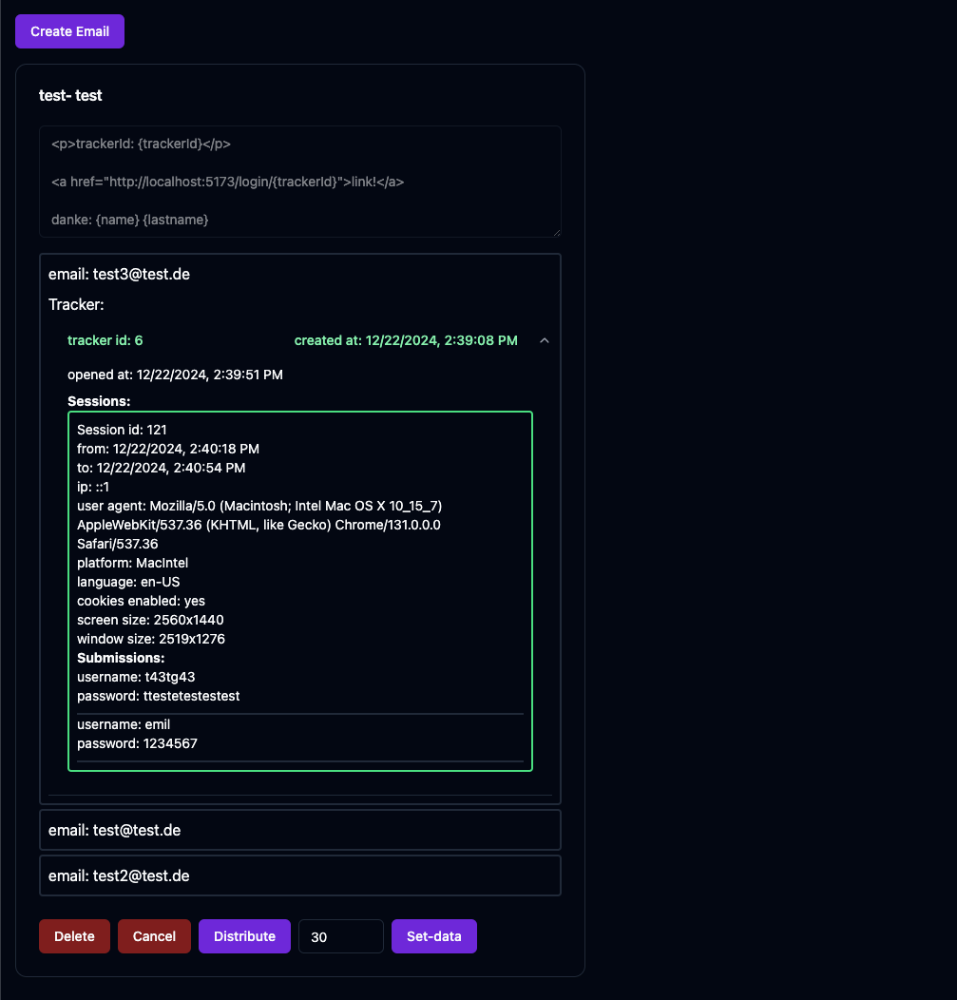

# LachsMailer
## This is a system for sending phishing emails to a list of recipients.

### features:
- Template system for replacing variables in the email body for each recipient\
Example: `Hello {name} {lastname}`

  | Email | name    | lastname    |
  | :---:   | :---: | :---: |
  | test@test.de | test   | test   |
- Tracking of opened emails
- Session system for saving:
  - Start/End time
  - mouse movement
  - key presses
  - input submission
  - browser information
    - User-Agent
    - Browser
    - Platform
    - Language
    - Screen resolution
    - Window size
    - Ipaddress
    - CookiesEnabled

